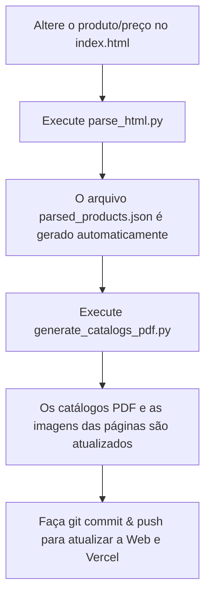

# Fraga Lumiéra — Landing Page & Catálogo Digital Premium

Este repositório contém a Landing Page de alta costura e o sistema de compilação de catálogos digitais da **Fraga Lumiéra**, marca de cosméticos capilares premium sediada em Aracaju/SE. O projeto foi projetado com foco em experiência visual rica (Aesthetics-First), otimização SEO avançada e facilidade de manutenção.

---

## ─── 💎 Funcionalidades Principais

* **Identidade Visual Premium:** Paleta de cores sofisticada baseada em tons de dourado metálico, preto fosco e cinza acetinado, utilizando efeitos de Glassmorphism, desfoque matte e microanimações fluidas.
* **Sistema de Filtro de Catálogos (SEO-Friendly):** Alternância entre a linha *Home Care* e a linha *Profissional* diretamente na DOM, permitindo indexação completa de todos os produtos pelos robôs de busca.
* **Integração com WhatsApp (Gerador de Pedidos):** Links dinâmicos parametrizados em cada produto que capturam automaticamente o nome do produto, o ID, a linha e o preço à vista para iniciar uma conversa com mensagem pré-preenchida no WhatsApp de consultoria.
* **Gerador de Catálogos PDF Dinâmico:** Script em Python que consome a estrutura HTML do site para gerar de forma automatizada os arquivos PDF para download com alinhamento milimétrico, capas, rodapés estilizados e condições de pagamento inclusas.
* **SEO e Schema Local:** Otimização completa com meta tags Open Graph (Facebook/Instagram), Twitter Cards e dados estruturados JSON-LD (Schema.org) no formato de `HairSalon` / `LocalBusiness` focado na Galeria Squadra em Aracaju.

---

## ─── 🏗️ Arquitetura e Estrutura de Arquivos

A estrutura do projeto foi dividida de maneira modular para separar a lógica de apresentação na web da lógica de renderização dos PDFs:

```bash
├── .vercel/                      # Configuração de deploy da Vercel (Project & Team ID)
├── assets/
│   ├── pages/                    # Imagens base das páginas do PDF e páginas compiladas (JPG)
│   └── products/                 # Banco de imagens de alta definição dos produtos capilares
├── index.html                    # Estrutura principal da Landing Page e catálogo estático
├── styles.css                    # Design system (CSS Variables, animações e responsividade)
├── script.js                     # Menu mobile, filtros rápidos e construtor de links de WhatsApp
├── parse_html.py                 # Utilitário de scraping local (HTML ➔ JSON)
├── parsed_products.json          # Banco de dados estruturado gerado automaticamente a partir do HTML
├── generate_catalogs_pdf.py      # Motor de compilação gráfica de PDFs usando PIL (Pillow)
├── catalogo-home-care.pdf        # Catálogo PDF finalizado para download da Linha Home Care
└── catalogo-profissional.pdf     # Catálogo PDF finalizado para download da Linha Profissional
```

---

## ─── ⚙️ Tecnologias Utilizadas

1. **Frontend Core:** HTML5 semântico e CSS3 Vanilla (sem dependências externas de frameworks pesados para garantir carregamento sub-segundo).
2. **Interações Client-side:** Javascript (ES6) puro para gestão de estado dos filtros e formatação de links.
3. **Engine de PDF (Backend/Compilação):** Python 3 com as bibliotecas:
   * `Pillow (PIL)`: Manipulação de imagem de alta performance para renderizar os cards de produtos.
   * `html.parser` & `json`: Parsing automatizado de dados locais.
4. **Hospedagem & Nuvem:** Plataforma Vercel com DNS integrado na Hostinger sob o domínio [fragalumiera.com.br](https://fragalumiera.com.br).

---

## ─── 🔄 Fluxo de Atualização de Produtos

O projeto possui um ecossistema de atualização simples baseado em **Single Source of Truth** (a fonte da verdade é o `index.html`):



### Comandos de Atualização:

1. **Passo 1 — Sincronizar o banco de dados:**
   ```bash
   python parse_html.py
   ```
2. **Passo 2 — Compilar os PDFs:**
   ```bash
   python generate_catalogs_pdf.py
   ```

---

## ─── 💳 Condições Comerciais Padronizadas

Conforme regras de negócio atuais integradas tanto nas páginas do site quanto em todas as folhas dos catálogos PDF gerados:
* **Desconto PIX:** 5% de desconto para pagamentos à vista via Pix.
* **Até 3x Sem Juros:** Disponível para compras a partir de R$ 99,00.
* **Até 5x Sem Juros:** Disponível para compras a partir de R$ 199,00.
